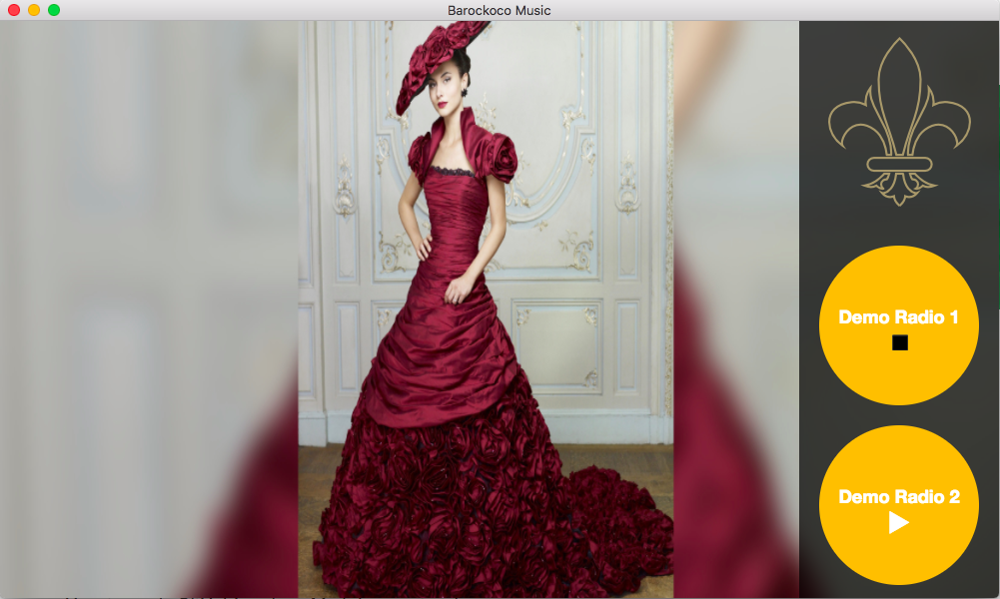

# Barockoco Music

> Radiostations and advertisement




App expects api to serve:

### `/api/v2/?random=${connectionCheckToken}`
response should be content of `connectionCheckToken`
 
### `/api/v2/radiochannels`

```
[
	{
		"title": "My Channel",
		"url": "https://my.radiostati.on/path",
		"color": "#FF0000"
	}
]
```

### `/api/v2/radiocommercials`

```
[
	{
		"title": "my ad",
		"picture": "https://my.radiostati.on/images/pic_1920x1080.jpg"
	}
]
```

### Todos
- Enable Auto-Update after aquired paid Apple Developer Cert

## Dev

```
$ npm install
```

### Run

```
$ npm start
```

### Build

```
$ npm run build
```

Builds the app for macOS, Linux, and Windows, using [electron-packager](https://github.com/electron-userland/electron-packager).


## License

MIT © [Oliver Möller](https://github.com/phenyll)
